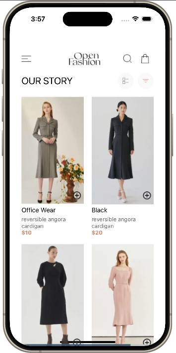
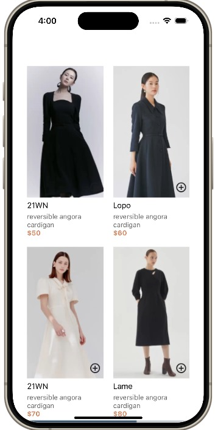
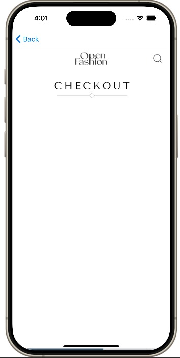
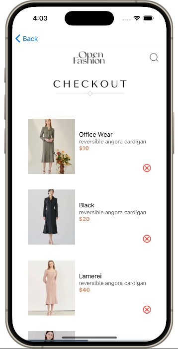

# Open Fashion App

## Overview
The Open Fashion App is a modern and stylish React Native application designed to showcase and sell clothing items. Users can browse products, add items to their cart, and proceed to checkout. The app features a clean design with a focus on user experience, utilizing local storage to save cart items persistently.

## Components
- Home Screen
- Cart Screen

### Home Screen
- **Description**: The home screen serves as the main interface where users can view a selection of clothing items. It includes a navigation header, a product list, and options to filter and view items.
- **Usage**: Users can scroll through the product list, add items to their cart, and navigate to the cart screen.

- **Screenshot**:  
  
  

### Cart Screen
- **Description**: The cart screen displays the items added to the user's cart. It includes options to remove items and proceed to checkout.
- **Usage**: Users can view their selected items, adjust quantities, and remove items from the cart.

- **Screenshot**:  
  
  

## Installation and Setup
1. Clone the repository:
   ```bash
   git clone https://github.com/samuelGyasiFordjour/-rn-assignment6-11053488.git

# Data Storage
The Open Fashion App uses local storage to persist the cart items, ensuring that the items remain in the cart even after the app is closed. This is achieved using AsyncStorage in React Native.

# Usage Example
```
import AsyncStorage from '@react-native-async-storage/async-storage';

// Save cart items to local storage
const saveCartItems = async (cartItems) => {
  try {
    const jsonValue = JSON.stringify(cartItems);
    await AsyncStorage.setItem('@cart_items', jsonValue);
  } catch (e) {
    console.error('Error saving cart items', e);
  }
};

// Load cart items from local storage
const loadCartItems = async () => {
  try {
    const jsonValue = await AsyncStorage.getItem('@cart_items');
    return jsonValue != null ? JSON.parse(jsonValue) : [];
  } catch (e) {
    console.error('Error loading cart items', e);
  }
};

// Add an item to the cart and save it
const addToCart = async (product) => {
  const currentCart = await loadCartItems();
  const updatedCart = [...currentCart, product];
  await saveCartItems(updatedCart);
};

// Remove an item from the cart and save the updated cart
const removeFromCart = async (productId) => {
  const currentCart = await loadCartItems();
  const updatedCart = currentCart.filter((product) => product.id !== productId);
  await saveCartItems(updatedCart);
};
```
## Student ID: 11053488